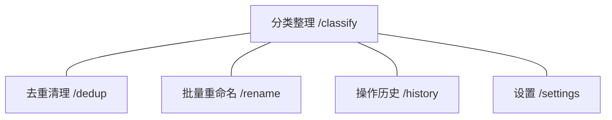

# 文件整理大师 (FileMaster) PRD

## 0. 文档元信息

- 文档状态：草稿
- 版本：v0.1
- 最后更新：2026-06-28
- 产品名称：文件整理大师 (FileMaster)
- 负责人：个人开发者
- 目标读者：开发 / 测试 / 你自己
- 文档边界：PRD，定义产品做什么不做什么，开发据此实现

---

## 1. 产品结论

### 1.1 核心定位（一句锁死）
```text
为普通电脑用户提供一键式文件整理工具，自动分类归档、智能去重、批量重命名，把混乱的文件夹变成井井有条。
```

### 1.2 明确不做 / 不是什么
- 不做云端同步和云存储
- 不做文件内容预览/编辑
- 不做协作/多用户功能
- 不做系统文件/隐藏文件操作（安全红线）
- 不是备份工具
- 第一期不做定时自动整理

### 1.3 核心目标与成功标志
| 目标 | 说明 | 成功标志（可验证） |
|------|------|------------------|
| 一键分类 | 用户选一个文件夹，自动按类型归档 | 1000 个混杂文件，30 秒内完成分类，准确率 ≥95% |
| 智能去重 | 找出重复文件，帮用户清理空间 | 能识别同名+同大小的重复文件，支持预览后批量删除 |
| 批量重命名 | 按规则统一重命名 | 支持至少 3 种命名模式（序号、日期、自定义模板） |
| 傻瓜化操作 | 普通用户不看教程就能用 | 新用户 3 步内完成一次完整整理 |

---

## 2. 用户、场景与形态

### 2.1 目标用户
| 用户类型 | 关注点 | 产品要回答的问题 |
|---------|-------|----------------|
| 普通上班族 | 桌面/下载文件夹太乱，找不到文件 | 按什么规则分类最合理？操作会不会搞丢文件？ |
| 学生 | 课件、论文、资料散落各处 | 能不能按学期/课程自动整理？ |
| 家庭用户 | 照片、视频、文档混在一起 | 照片和普通文件能不能分开处理？ |

### 2.2 关键用户任务
1. 打开应用 → 选择要整理的文件夹 → 预览将要执行的操作 → 确认执行
2. 扫描重复文件 → 查看重复列表 → 选择保留策略 → 一键清理
3. 选中一批文件 → 设定重命名规则 → 预览效果 → 确认执行

### 2.3 ★ 形态与资源约束（最关键）
| 项 | 决定 |
|----|------|
| 它活在哪 | Flutter 桌面应用，需安装，本地运行 |
| 已有可复用资源 | 域名、服务器（用于激活验证和版本更新检查） |
| 数据存哪、留不留得住 | 本地 SQLite 存操作历史（可回滚）；不存文件内容，不上传任何文件 |
| 谁来长期维护 | 个人开发者 |
| 预算与按量成本 | 服务器已有；App Store 开发者账号 $99/年；无 AI 接口等按量成本 |

---

## 3. 信息架构（UI 类产品）

### 3.1 导航 / 入口
| 入口 | 路由 | 说明 |
|------|------|------|
| 分类整理 | /classify | 主功能：选文件夹→预览→执行分类 |
| 去重清理 | /dedup | 扫描重复文件→预览→清理 |
| 批量重命名 | /rename | 选文件→设定规则→预览→执行 |
| 操作历史 | /history | 查看过往操作记录，支持回滚 |
| 设置 | /settings | 分类规则、语言、激活状态 |

### 3.2 路由兜底规则
| 输入 | 处理 |
|------|------|
| 空 / 未知路由 | 进入分类整理页（首页） |

### 3.3 页面结构总览


---

## 4. 页面 / 功能规格

### 4.1 分类整理 ` /classify`
页面目标：用户选文件夹，预览分类结果，确认执行。

| 元素 | 内容要求 | 点击 / 行为结果 |
|------|---------|---------------|
| 文件夹选择器 | 显示当前选中路径，默认空 | 点击弹出系统文件夹选择对话框 |
| 扫描按钮 | "开始扫描" | 扫描选中文件夹，显示文件统计（总数、类型分布） |
| 分类预览列表 | 按目标子文件夹分组展示 | 每行显示：原路径 → 目标路径，可单独取消 |
| 分类规则选择 | 预设规则下拉：按类型/按日期/自定义 | 切换后重新生成预览 |
| 执行按钮 | "确认整理" | 执行文件移动，显示进度条，完成后提示结果 |
| 结果摘要 | 移动了 X 个文件，创建了 Y 个文件夹 | 执行完成后展示 |

### 4.2 去重清理 ` /dedup`
页面目标：找重复文件，帮用户安全清理。

| 元素 | 内容要求 | 点击 / 行为结果 |
|------|---------|---------------|
| 文件夹选择器 | 可多选目录 | 点击弹出选择对话框 |
| 扫描按钮 | "扫描重复文件" | 按文件名+大小哈希扫描，显示进度 |
| 重复组列表 | 每组显示：文件名、位置、大小、修改时间 | 每组默认保留最旧/最新一个，用户可改选 |
| 保留策略 | "保留最新" / "保留最旧" / "手动选择" | 切换后刷新保留标记 |
| 空间节省提示 | "删除 X 个文件，释放 Y MB" | 实时更新 |
| 执行按钮 | "删除重复文件" | 移到回收站（不永久删除），完成后提示 |

### 4.3 批量重命名 ` /rename`
页面目标：选中一批文件，按规则统一重命名。

| 元素 | 内容要求 | 点击 / 行为结果 |
|------|---------|---------------|
| 文件添加区 | 拖拽或点击添加文件 | 显示已选文件列表（原名+预览新名） |
| 命名规则区 | 模板输入框 + 预设按钮 | 支持 {序号}、{日期}、{原名} 占位符 |
| 预设规则 | "序号重命名" / "日期前缀" / "查找替换" | 点击填入对应模板 |
| 实时预览 | 每行显示：原名 → 新名 | 修改模板实时刷新 |
| 执行按钮 | "确认重命名" | 执行重命名，显示结果 |

### 4.4 操作历史 ` /history`
页面目标：查看过往操作，必要时回滚。

| 元素 | 内容要求 | 点击 / 行为结果 |
|------|---------|---------------|
| 历史列表 | 时间、操作类型、涉及文件数、状态 | 按时间倒序 |
| 回滚按钮 | 仅最近 10 条操作可回滚 | 确认后撤销操作（文件移回原位） |
| 清空历史 | 按钮 | 确认后清空所有记录 |

### 4.5 设置 ` /settings`
| 元素 | 内容要求 | 点击 / 行为结果 |
|------|---------|---------------|
| 分类规则配置 | 文件扩展名 → 目标文件夹映射 | 可新增、编辑、删除 |
| 语言切换 | 简体中文 / English | 即时切换 |
| 激活状态 | 显示是否已激活 | 未激活时显示购买入口 |
| 版本更新 | 显示当前版本 + 检查更新按钮 | 点击查询服务器最新版本 |

---

## 5. 链路闭合（无死胡同）

| 入口 | 点击后 |
|------|-------|
| 首页"开始扫描" | → 扫描中 → 显示预览 → 可执行或返回 |
| 去重页"扫描重复文件" | → 扫描中 → 显示重复组 → 可执行或返回 |
| 重命名页"确认重命名" | → 执行中 → 显示结果 |
| 历史页"回滚" | → 确认弹窗 → 执行回滚 → 刷新列表 |
| 设置"检查更新" | → 请求服务器 → 显示"已是最新"或"发现新版本" |
| 底部导航栏 5 个 Tab | → 切换到对应页面，保持当前页状态 |

---

## 6. 状态与反馈规则

| 状态 / 操作 | 规则 |
|-----------|------|
| 扫描中 | 显示进度条+已扫描文件数，可取消 |
| 扫描结果为空 | 显示"没有找到需要整理的文件"，不显示空表格 |
| 执行中 | 显示进度，禁用所有操作按钮 |
| 执行成功 | 绿色提示 + 结果摘要，3 秒后自动消失 |
| 执行失败 | 红色提示 + 错误原因 + "重试"按钮 |
| 文件夹无权限 | 弹窗提示"无权限访问，请选择其他文件夹" |
| 文件正在被占用 | 跳过该文件，执行完成后列出"跳过的文件" |
| 未激活 | 功能页顶部显示横幅提示，限制单次最多处理 100 个文件 |
| 磁盘空间不足 | 执行前检查，不足时警告并阻止执行 |

---

## 7. 边界情况与容错

| 情况 | 希望它怎么办 |
|------|------------|
| 文件名超长（>255 字符） | 自动截断，保留扩展名 |
| 文件名含特殊字符（/、\0 等） | 替换为下划线 |
| 目标文件夹已有同名文件 | 自动加序号后缀（如 "报告(1).pdf"） |
| 用户选了系统目录 | 弹出警告，阻止操作 |
| 扫描时磁盘断开（如 U 盘拔出） | 终止当前操作，提示"设备已断开"，保留已完成部分 |
| 超大文件夹（>10 万文件） | 分批扫描，显示"正在扫描（第 N 批）" |
| 零字节文件 | 分类时归入"其他"，去重时标记但默认不删 |
| 符号链接/快捷方式 | 跳过不处理，扫描结果中注明 |
| 应用崩溃恢复 | 重启后检查是否有未完成操作，提示用户确认状态 |

---

## 8. 内容与合规

### 8.1 必须表达
- 所有文件操作均在本地完成，不上传任何文件
- 删除操作默认移入回收站，可恢复
- 操作前均有预览，用户确认后才执行

### 8.2 禁止表达
- 不承诺 100% 不丢文件（免责声明："请在使用前备份重要文件"）
- 不展示其他用户的任何信息
- 不将"用了 Flutter 框架"等技术细节作为卖点

---

## 9. 验收标准

| 编号 | 验收项 | 通过标准 |
|------|-------|---------|
| AC-1 | 分类整理 | 当用户选择包含 100 个混合文件（图片、文档、视频、压缩包、其他）的文件夹，点击"开始扫描"后，在 5 秒内显示分类预览，点击"确认整理"后文件被移入对应子文件夹，每个子文件夹命名正确 |
| AC-2 | 去重扫描 | 当文件夹中存在 5 组重复文件（每组 2-3 个副本），点击"扫描重复文件"后，在 10 秒内识别出所有重复组，每组显示文件名、路径和大小 |
| AC-3 | 去重删除 | 在重复文件预览中，点击"删除重复文件"后，文件被移入系统回收站而非永久删除，可从回收站恢复 |
| AC-4 | 批量重命名 | 当选中 50 个文件，使用"序号重命名"规则（模板：`文件_{序号}`），预览正确显示新名称，确认后所有文件按规则重命名 |
| AC-5 | 操作回滚 | 当完成一次分类整理后，在操作历史中找到该记录，点击"回滚"，确认后所有文件恢复到原始位置 |
| AC-6 | 系统目录保护 | 当用户尝试选择系统目录（如 `/System`、`C:\Windows`），弹出警告并阻止操作 |
| AC-7 | 未激活限制 | 当应用未激活时，单次操作超过 100 个文件时提示"激活后解除限制" |
| AC-8 | 跨平台一致性 | 同一功能在 macOS 和 Windows 上行为一致，UI 风格各自遵循平台规范 |

---

## 10. MVP 完成定义

1. 分类整理功能完整可用（扫描→预览→执行→回滚）
2. 去重清理功能完整可用（扫描→预览→删除→回滚）
3. 批量重命名功能完整可用（选文件→设规则→预览→执行→回滚）
4. 操作历史可查看、可回滚最近操作
5. macOS 和 Windows 均可安装运行
6. 未激活限制机制生效（≤100 文件试用）
7. 基础激活验证（本地密钥校验）
8. 应用图标和基础品牌包装

---

## 11. 以后再说（可扩展项）

| 方向 | 说明 |
|------|------|
| 智能分类 | AI 识别文件内容自动分类（如发票、合同、简历），非扩展名分类 |
| 定时整理 | 设置定时任务，自动监控文件夹变化并整理 |
| 自定义规则市场 | 用户可分享/下载分类规则模板 |
| 照片按 EXIF 日期整理 | 读取照片拍摄日期，按年/月/日归档 |
| 云盘支持 | 支持整理 OneDrive、Google Drive 等云盘文件 |
| 命令行版本 | 供进阶用户脚本调用 |
| 国际化 | 英语之外支持更多语言 |
| 激活服务器 | 在线激活、激活码管理、防破解 |
